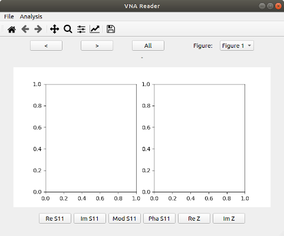
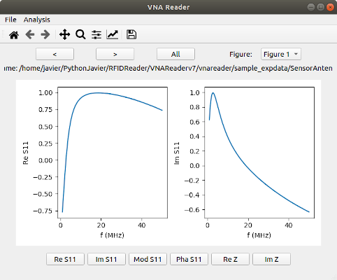
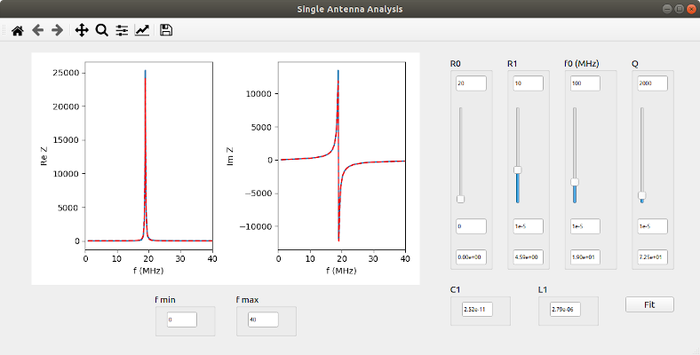
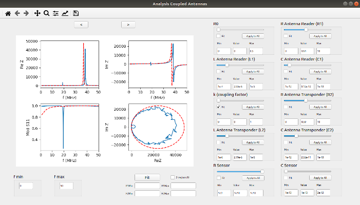

# VNAReader
GUI for visualization and analysis of the reflection scattering parameter S11 registered in biosensors setups.

The current version is designed for S11 values registered as Real and Imaginary components with a DG8-SAQ Vector Network Analyzer (VNA, SDR-Kits). Implementation to load data from different VNAs or formats should be easy. If you are interested, contact me.

So far, this is used just by my [group](https://www.mah.se/sotres). I will add a manual as soon as I have the time. For the time being, just have a look at the Quick Start section below.

## Requiremenets
Tested with python 3.7

Requires:
* numpy
* matplotlib
* PyQt5
* lmfit

## Quick Start
A virtual environment created with pipenv is provided.

Just fork the repository, and in the main folder type:
```python
pipenv install --ignore-pipfile
```
If you do not have pipenv istalled, just do it:
```python
pip install pipenv
```

Once the virtual environment has been created, just enter the pipenv shell i.e., type:
```python
pipenv shell
```

And then, for running the program type:
```python
python -m vnareader
```

This should open the following GUI:



Go to File -> Open to load the VNA S11 file, then you will see Real and Imaginary components of this quantity in the figure axis:



You can change the S11 representation using the buttons in the bottom of the GUI for the selected Plot (which you can select in the upper right corner of the GUI)

If the data corresponds to a single antenna connected to the VNA, you can analyze it by going to Analysis -> Single Antenna. This should take you to the following GUI:



If the data corresponds instead to two coupled antennas, one of them being the reader antenna, and the other one being the tag antenna which is itself connected to a sensing element, you can analyze it by going to Analysis -> Coupled Antennas. This should take you to the following GUI:




## Author
[Javier Sotres](https://github.com/JSotres)
